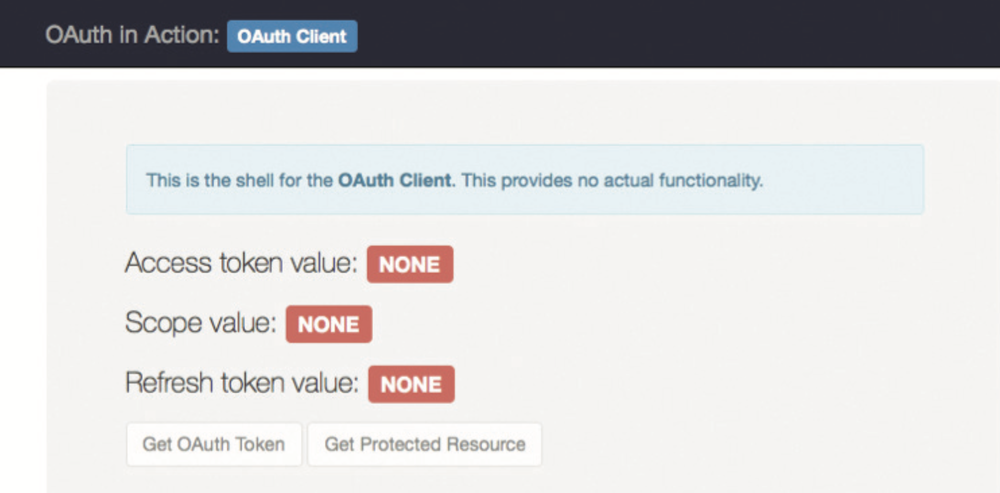
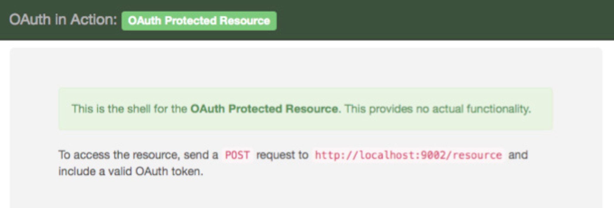

A set of start-from-scratch OAuth applications in JavaScript using the [Express.js](http://expressjs.com/) web
application framework running on [Node.js](https://nodejs.org/), a server-side JavaScript engine.

We are only making use of library code for non-OAuth-specific functionality to avoid complicated dependencies

```bash
npm install
node client.js
node authorizationServer.js
node protectedResource.js
```

Each component is set up to run on a different port on localhost, in a separate process:

- The OAuth Client application (client.js) runs on http://localhost:9000/

  

- The OAuth Authorization Server application (authorizationServer.js) runs on http://localhost:9001/

  

- The OAuth Protected Resource Application (protectedResource.js) runs on http://localhost:9002/

  

All of the applications have been set up to serve static files such as images and Cascading Style Sheets (CSS). These
are included in the `files` directory. In addition, there are HTML templates in the `files` directory. These are used
in the applications to generate HTML pages based on variable inputs. When templates are used, they are set up at the
beginning of the application with the following code:

```javascript
app.engine('html', cons.underscore);
app.set('view engine', 'html');
app.set('views', 'files');
```